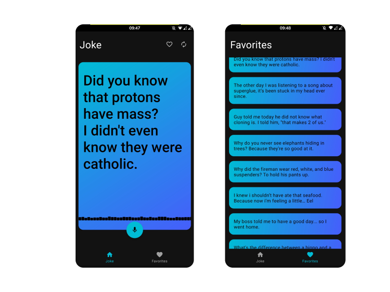
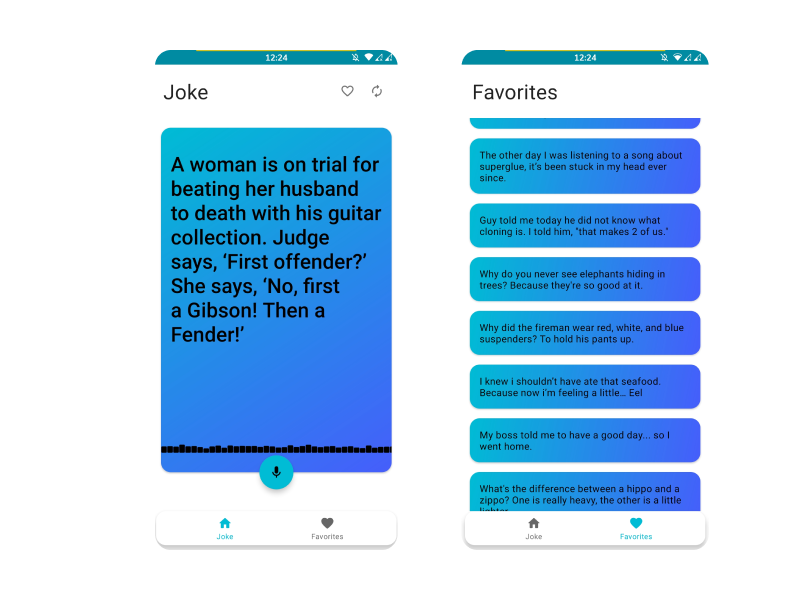

# Dad Jokes

An app that speaks Dad jokes, you can save your favorite to tell it to your friends later.

## Screenshots

    
    

## Motivation

The focus of this project is to learn how to create custom views, also how to introduce DIY dependency injection without any external libraries.

## Libraries Used

- [**KotlinCoroutines**](https://github.com/Kotlin/kotlinx.coroutines)
- [**Lifecycle**](https://developer.android.com/topic/libraries/architecture)
- [**LiveData**](https://developer.android.com/topic/libraries/architecture)
- [**Moshi**](https://github.com/square/moshi/)
- [**mockk**](https://github.com/mockk/mockk)
- [**Retrofit**](https://github.com/square/retrofit)
- [**Room**](https://developer.android.com/topic/libraries/architecture)
- [**Timber**](https://github.com/JakeWharton/timber)
- [**ViewBinding**](https://developer.android.com/topic/libraries/architecture)
- [**ViewModel**](https://developer.android.com/topic/libraries/architecture)
- [**WorkManager**](https://developer.android.com/topic/libraries/architecture)

## Gradle

- [**Gradle Kotlin DSL**](https://docs.gradle.org/current/userguide/kotlin_dsl.html)

## Static Analysis

- [**ktlint**](https://github.com/pinterest/ktlint) with the [ktlint-gradle](https://github.com/jlleitschuh/ktlint-gradle).

- [**detekt**](https://github.com/detekt/detekt).

## CI

Workflow available:

- [Build and check](.github/workflows/build-and-check.yaml) - Will run the `build` and `check` task.

## Contributing

Feel free to open a issue or submit a pull request for any bugs/improvements.
